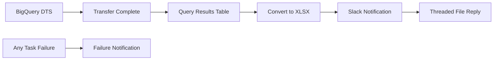
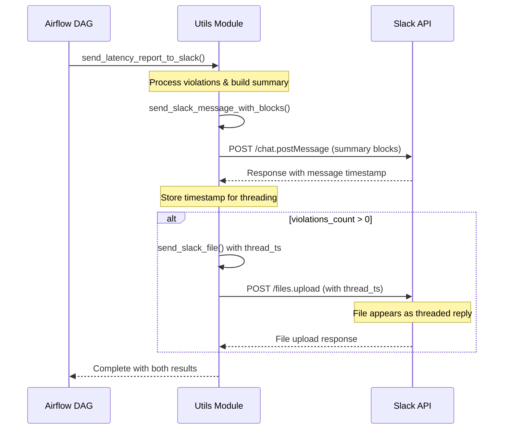

[](https://github.com/ashyam-saras/data-latency-alerts/actions/workflows/deploy-dags.yml)

# Data Latency Alerts

A streamlined Airflow DAG that monitors data freshness by integrating with BigQuery Data Transfer Service and sends rich Slack notifications with XLSX reports in threaded conversations.

## 🏗️ Architecture Overview

Simple and efficient workflow:

1. **BigQuery Data Transfer Service**: Triggers pre-configured transfer job and waits for completion
2. **Direct Query**: Simple `SELECT *` from processed results table
3. **XLSX Generation**: Converts results to XLSX with timestamp handling
4. **Rich Slack Notifications**: Professional block formatting with threaded file attachments

## ✨ Features

- **🔄 Data Transfer Integration**: Automated BigQuery DTS job triggering
- **📊 Smart XLSX Reports**: Automatic timestamp conversion for JSON serialization
- **🧵 Threaded File Attachments**: Reports sent as threaded replies for organized conversations
- **🎨 Rich Slack Blocks**: Professional notifications with buttons linking to Airflow logs
- **🔧 Flexible Channels**: Support for multiple comma-separated Slack channels
- **⚡ Error Handling**: Context-aware failure notifications with direct links to task logs
- **🏷️ Organized Variables**: All configuration uses `LATENCY_ALERTS__` prefix

## 🚀 Quick Start

### 1. Configure Airflow Variables

All variables use the `LATENCY_ALERTS__` prefix for organization:

```bash
# Required Variables
LATENCY_ALERTS__BQ_DTS_CONFIG_ID = your-transfer-config-id

# Core Configuration (with defaults)
LATENCY_ALERTS__PROJECT_NAME = insightsprod
LATENCY_ALERTS__AUDIT_DATASET_NAME = edm_insights_metadata  
LATENCY_ALERTS__BIGQUERY_LOCATION = us-central1

# Slack Configuration
LATENCY_ALERTS__SLACK_CHANNELS = #data-alerts,#monitoring

# Optional
LATENCY_ALERTS__AIRFLOW_BASE_URL = https://your-airflow-instance.com
```

### 2. Set Up Connections

**BigQuery Connection**: `data_latency_alerts__conn_id`
- Connection Type: Google Cloud
- Service account with: BigQuery Data Viewer, BigQuery Job User, BigQuery Data Transfer Admin

**Slack Connection**: `slack_default`
- Connection Type: Slack Webhook
- Password: Bot User OAuth Token (xoxb-...)
- Required scopes: `chat:write`, `files:write`, `channels:read`, `groups:read`

### 3. Deploy

The DAG automatically deploys when you push to the main branch.

## 📋 DAG Workflow

**Schedule**: Every 6 hours starting at 12 PM IST (12 PM, 6 PM, 12 AM, 6 AM)

| Task | Description |
|------|-------------|
| `start_data_transfer` | Triggers BigQuery DTS job and waits for completion |
| `run_latency_check` | Queries `raw_table_latency_failure_details` table |
| `convert_to_xlsx` | Converts results to XLSX with proper timestamp handling |
| `send_notification` | Sends success/failure notifications with rich formatting |

## 📊 Data Flow



## 🎯 Slack Notifications

### Success Notifications
- **📄 XLSX File**: Latency violations with rich context (sent as threaded reply)
- **✅ No Violations**: Clean success message
- **🔗 Action Buttons**: Direct links to Airflow DAG and task logs

### Failure Notifications
- **🚨 Context-Aware Messages**: Different messages for transfer, query, or conversion failures
- **📋 Error Details**: Task-specific error information
- **🔗 Log Access**: Direct buttons to failed task logs

### Threaded File Attachments

The system sends report attachments as threaded replies to keep conversations organized:



### Block Templates
- `latency_report_success`: For violations found
- `latency_report_no_violations`: For clean runs
- `bigquery_failure`: For BigQuery-specific errors
- `slack_failure`: For Slack API errors

## ⚙️ Configuration Details

### Required Table Structure

The DAG expects this table to exist after data transfer:
```sql
`{PROJECT_NAME}.{AUDIT_DATASET_NAME}.raw_table_latency_failure_details`
```

### Variable Reference

| Variable | Description | Default | Required |
|----------|-------------|---------|----------|
| `LATENCY_ALERTS__BQ_DTS_CONFIG_ID` | Transfer config ID (must be in us-central1) | None | ✅ |
| `LATENCY_ALERTS__PROJECT_NAME` | GCP project name | `insightsprod` | ❌ |
| `LATENCY_ALERTS__AUDIT_DATASET_NAME` | Metadata dataset | `edm_insights_metadata` | ❌ |
| `LATENCY_ALERTS__BIGQUERY_LOCATION` | BigQuery location | `us-central1` | ❌ |
| `LATENCY_ALERTS__SLACK_CHANNELS` | Comma-separated channels | `#slack-bot-test` | ❌ |
| `LATENCY_ALERTS__AIRFLOW_BASE_URL` | Base URL for DAG links | Auto-detected | ❌ |

### Multiple Slack Channels

Configure multiple channels with comma separation:
```bash
LATENCY_ALERTS__SLACK_CHANNELS = #data-alerts,#monitoring,#critical-alerts
```

## 📁 Project Structure

```
data-latency-alerts/
├── dags/
│   ├── data_latency_alerts_dag.py    # Main DAG file
│   ├── utils.py                      # Utility functions
│   └── slack_blocks.json             # Slack block templates
├── config/
│   └── README.md                     # Configuration guide
├── composer/                         # Cloud Composer environment
└── requirements.txt                  # Python dependencies
```

## 🔧 Development

### Local Development

```bash
# Clone repository
git clone <your-repo-url>
cd data-latency-alerts

# Install dependencies
pip install -r requirements.txt

# Set up environment variables (for testing)
export LATENCY_ALERTS__PROJECT_NAME="your-project"
export LATENCY_ALERTS__AUDIT_DATASET_NAME="your-dataset"
```

### Key Dependencies

```
apache-airflow==2.7.0
apache-airflow-providers-google==10.10.0
apache-airflow-providers-slack==7.3.0
pandas==2.0.3
openpyxl==3.1.2
jinja2==3.1.2
google-cloud-bigquery-datatransfer==3.11.0
```

## 🚨 Troubleshooting

### Common Issues

| Issue | Solution |
|-------|----------|
| **Transfer Config Not Found** | Verify `LATENCY_ALERTS__BQ_DTS_CONFIG_ID` and ensure config exists in `us-central1` |
| **Permission Errors** | Check service account has BigQuery Data Transfer Admin role |
| **Slack API Errors** | Verify connection scopes and bot permissions |
| **Table Not Found** | Ensure data transfer creates the expected results table |
| **Timestamp Serialization** | Fixed automatically - timestamps converted to ISO strings |

### Debug Steps

1. **Check Variables**: Admin → Variables in Airflow UI
2. **Verify Connections**: Admin → Connections
3. **Review Logs**: Click direct log buttons in Slack notifications
4. **Test Transfer**: Manually run transfer config in BigQuery console

## 🔄 Migration Notes

If migrating from a previous version:

1. **Update Variables**: Add `LATENCY_ALERTS__` prefix to all variables
2. **Remove Old Files**: Delete unused test files and reports
3. **Update Connections**: Ensure proper scopes and permissions
4. **Verify Transfer Config**: Must be in `us-central1` location

## 📈 Performance

- **Execution Time**: ~2-5 minutes including transfer wait time
- **Resource Efficiency**: Uses deferrable operators
- **Scalability**: Handles large result sets with streaming
- **Cost Optimization**: Single transfer + simple query approach

## 🤝 Contributing

1. Fork the repository
2. Create feature branch: `git checkout -b feature-name`
3. Commit changes: `git commit -am 'Add feature'`
4. Push branch: `git push origin feature-name`
5. Create Pull Request

## 📄 License

This project is licensed under the MIT License.

---

**Need Help?** Check the [configuration guide](config/README.md) or review the troubleshooting section above.
