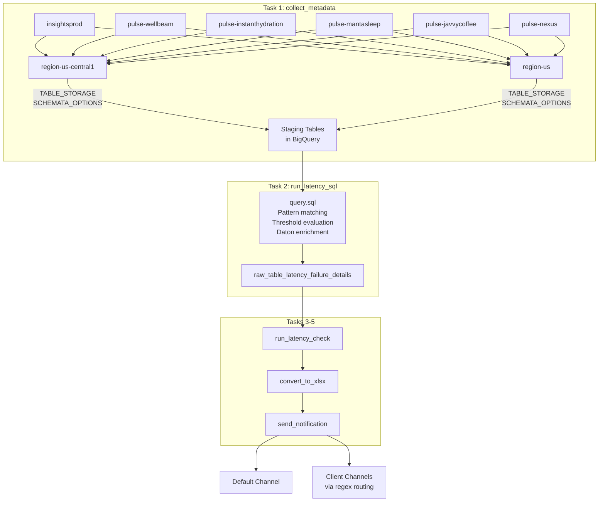
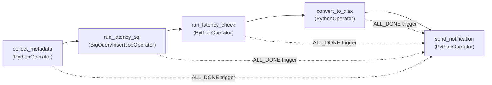
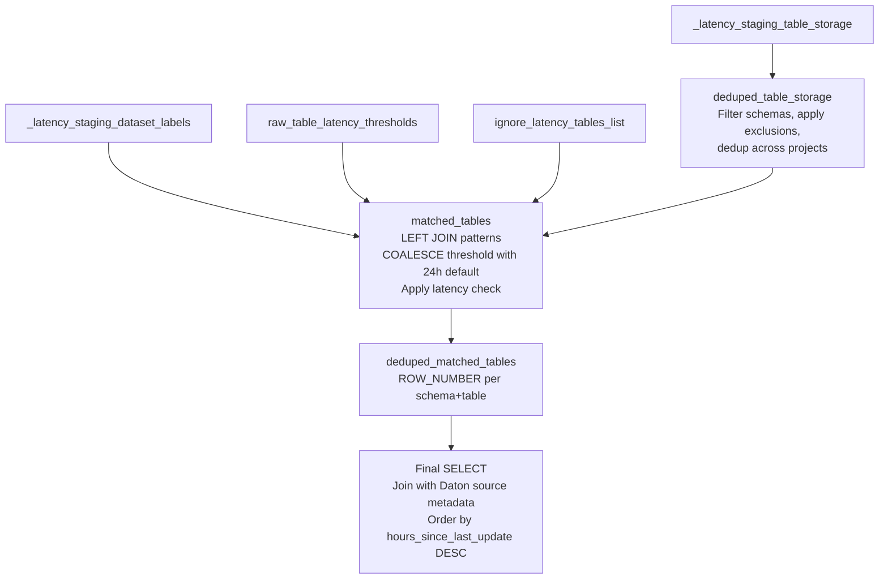

[](https://github.com/ashyam-saras/data-latency-alerts/actions/workflows/deploy-dags.yml)

# Data Latency Alerts

An Airflow DAG that monitors data freshness across multiple BigQuery projects and regions. It detects tables exceeding latency thresholds and sends rich Slack notifications with XLSX reports routed to client-specific channels.

## Architecture


```mermaid
flowchart TB
  subgraph metadata ["Task 1: collect_metadata"]
    direction TB
    P1["insightsprod"]
    P2["pulse-wellbeam"]
    P3["pulse-instanthydration"]
    P4["pulse-mantasleep"]
    P5["pulse-javvycoffee"]
    P6["pulse-nexus"]

    R1["region-us-central1"]
    R2["region-us"]

    P1 & P2 & P3 & P4 & P5 & P6 --> R1 & R2

    R1 & R2 -->|"TABLE_STORAGE\nSCHEMATA_OPTIONS"| Staging["Staging Tables\nin BigQuery"]
  end

  subgraph analysis ["Task 2: run_latency_sql"]
    Staging --> Query["query.sql\nPattern matching\nThreshold evaluation\nDaton enrichment"]
    Query --> Results["raw_table_latency_failure_details"]
  end

  subgraph reporting ["Tasks 3-5"]
    Results --> Check["run_latency_check"]
    Check --> XLSX["convert_to_xlsx"]
    XLSX --> Slack["send_notification"]
  end

  Slack --> Default["Default Channel"]
  Slack --> Client["Client Channels\nvia regex routing"]
```

## How It Works

### Cross-Region Metadata Collection

BigQuery `INFORMATION_SCHEMA` views are region-scoped — a job in `us-central1` cannot access `region-us` metadata. To solve this, the DAG's first task uses Python with `BigQueryHook` to query each project and region combination separately (with the correct job location), then writes the combined results to staging tables in `us-central1`.

This runs in parallel using `ThreadPoolExecutor` (6 workers) and gracefully skips project/region combinations that don't exist (404 errors are caught and logged).

### Latency Evaluation

The SQL query (`query.sql`) evaluates latency by:

1. Reading pre-collected metadata from staging tables
2. Filtering to monitored schemas: `_prod_raw`, `daton`, `BQ`, and `nexus_gds_raw`
3. Applying exclusions (specific datasets and project-scoped exclusions)
4. Matching tables against configurable latency patterns from `raw_table_latency_thresholds`
5. Applying a 24-hour default threshold for daton/BQ tables that don't match any pattern
6. Enriching results with Daton source metadata (platform, status, last error)

### Client-Specific Slack Routing

Alerts are routed to client-specific Slack channels using regex pattern matching on `table_schema`. Each result row is tested against configured patterns, and matching rows are sent to the appropriate channel. All results are always sent to the default channel as well.

## DAG Workflow

**Schedule**: Daily at 1:00 PM IST (7:30 UTC)


```mermaid
flowchart LR
  T1["collect_metadata\n(PythonOperator)"]
  T2["run_latency_sql\n(BigQueryInsertJobOperator)"]
  T3["run_latency_check\n(PythonOperator)"]
  T4["convert_to_xlsx\n(PythonOperator)"]
  T5["send_notification\n(PythonOperator)"]

  T1 --> T2 --> T3 --> T4 --> T5
  T1 & T2 & T3 & T4 -.->|"ALL_DONE trigger"| T5
```

| Task | Type | Description |
|------|------|-------------|
| `collect_metadata` | PythonOperator | Queries `INFORMATION_SCHEMA.TABLE_STORAGE` and `SCHEMATA_OPTIONS` across all projects and regions, writes to staging tables |
| `run_latency_sql` | BigQueryInsertJobOperator | Runs `query.sql` against staging tables, writes violations to `raw_table_latency_failure_details` |
| `run_latency_check` | PythonOperator | Reads the violation results table into memory |
| `convert_to_xlsx` | PythonOperator | Converts results to XLSX with auto-adjusted column widths |
| `send_notification` | PythonOperator | Sends Slack notifications with routed results; handles both success and failure cases |

The `send_notification` task uses `trigger_rule=ALL_DONE` so it runs even if upstream tasks fail, sending a failure alert instead.

## Configuration

### Airflow Variables

| Variable | Description | Default |
|----------|-------------|---------|
| `LATENCY_ALERTS__PROJECT_NAME` | JSON array of GCP projects to monitor | `["insightsprod"]` |
| `LATENCY_ALERTS__AUDIT_DATASET_NAME` | Dataset for metadata and staging tables | `edm_insights_metadata` |
| `LATENCY_ALERTS__BIGQUERY_LOCATION` | BigQuery job location for analysis query | `us-central1` |
| `LATENCY_ALERTS__SLACK_CHANNELS` | JSON channel routing config (see below) | Required |
| `LATENCY_ALERTS__AIRFLOW_BASE_URL` | Base URL for Airflow log links in Slack | Auto-detected |

### Slack Channel Configuration

`LATENCY_ALERTS__SLACK_CHANNELS` is a JSON object where keys are regex patterns matched against `table_schema`, and values are Slack channel IDs. A `default` key is required.

```json
{
  "3642|nexus_gds_raw": "C07178BP4G7",
  "4997|poshpeanut": "C07SJE04J6T",
  "4634|ridge": "C0A443TJHT4",
  "4927|instanthydrati": "C0A87NP1GLR",
  "5363|trueseamoss": "C0AFKSU9Z0V",
  "5622|warmies": "C0AFKSU9Z0V",
  "5667|homefield": "C0AFKSU9Z0V",
  "default": "C06QY1KQJJG"
}
```

Pattern keys use regex `search` — `4927|instanthydrati` matches any `table_schema` containing `4927` OR `instanthydrati` (handles truncated daton dataset names).

### Airflow Connections

**BigQuery**: `data_latency_alerts__conn_id`
- Connection Type: Google Cloud
- Required roles: BigQuery Data Viewer, BigQuery Job User

**Slack**: `slack_default`
- Connection Type: Slack
- Password: Bot User OAuth Token (`xoxb-...`)
- Required scopes: `chat:write`, `files:write`, `channels:read`, `groups:read`

## Monitored Dataset Types

| Schema Pattern | Source | Threshold |
|----------------|--------|-----------|
| `%_prod_raw` | Raw data ingestion tables | Per-pattern from `raw_table_latency_thresholds` |
| `%daton%` | Daton connector tables | Per-pattern, or 24h default |
| `%BQ%` | BigQuery custom tables | Per-pattern, or 24h default |
| `nexus_gds_raw` | Nexus GDS raw data | Per-pattern from `raw_table_latency_thresholds` |

### Exclusion Mechanisms

1. **Dataset-level exclusions**: Hardcoded in `query.sql` (`table_schema NOT IN (...)`)
2. **Project-scoped exclusions**: `NOT (source_project_id = 'X' AND table_schema = 'Y')`
3. **Label-based exclusions**: Datasets with BigQuery label `latency_check_ignore=true`
4. **Table-level ignore list**: `insightsprod.edm_insights_metadata.ignore_latency_tables_list`

## BigQuery Tables

### Metadata Tables (read-only)

| Table | Purpose |
|-------|---------|
| `edm_insights_metadata.raw_table_latency_thresholds` | Pattern-to-threshold mapping |
| `edm_insights_metadata.ignore_latency_tables_list` | Explicit table ignore list |
| `pulse_metadata.gcp_postgres_daton_public_source_tables` | Daton source table metadata |
| `pulse_metadata.gcp_postgres_daton_public_source` | Daton source metadata |
| `pulse_metadata.gcp_postgres_daton_public_last_job_stats` | Daton job error details |

### Staging Tables (written by DAG)

| Table | Written By | Read By |
|-------|-----------|---------|
| `edm_insights_metadata._latency_staging_table_storage` | `collect_metadata` task | `query.sql` |
| `edm_insights_metadata._latency_staging_dataset_labels` | `collect_metadata` task | `query.sql` |
| `edm_insights_metadata.raw_table_latency_failure_details` | `run_latency_sql` task | `run_latency_check` task |

## SQL Query Flow


```mermaid
flowchart TB
  Staging["_latency_staging_table_storage"] --> Dedup["deduped_table_storage\nFilter schemas, apply exclusions,\ndedup across projects"]
  Labels["_latency_staging_dataset_labels"] --> Match
  Patterns["raw_table_latency_thresholds"] --> Match
  IgnoreList["ignore_latency_tables_list"] --> Match
  Dedup --> Match["matched_tables\nLEFT JOIN patterns\nCOALESCE threshold with 24h default\nApply latency check"]
  Match --> DedupMatch["deduped_matched_tables\nROW_NUMBER per schema+table"]
  DedupMatch --> Final["Final SELECT\nJoin with Daton source metadata\nOrder by hours_since_last_update DESC"]
```

## Project Structure

```
data-latency-alerts/
├── dags/
│   ├── data_latency_alerts_dag.py    # DAG definition and task callables
│   ├── query.sql                     # Latency evaluation SQL
│   ├── utils.py                      # BigQuery, Slack, and metadata utilities
│   └── slack_blocks.json             # Slack block templates
├── .github/
│   └── workflows/
│       └── deploy-dags.yml           # CI/CD deployment to Cloud Composer
└── README.md
```

## Deployment

DAGs automatically deploy to Cloud Composer when changes are pushed to `main` (paths: `dags/**` or the workflow file). The GitHub Actions workflow syncs the `dags/` directory to the Composer DAG bucket under a `data-latency-alerts/` subfolder.

Manual deployment is also available via `workflow_dispatch` with optional bucket path or environment name inputs.

## Troubleshooting

| Issue | Cause | Fix |
|-------|-------|-----|
| `NotFound: TABLE_STORAGE` | Project has no datasets in that region | Handled automatically — logged as warning and skipped |
| `LEFT ANTISEMI JOIN` error | `NOT EXISTS` with `LIKE` condition | Use pre-computed CTE with equality join instead |
| Staging table not found | `collect_metadata` task failed or didn't run | Check task logs; ensure BigQuery connection has write access to audit dataset |
| Missing daton/BQ tables | Dataset not matching schema filters | Verify `table_schema` matches `%daton%` or `%BQ%` patterns |
| Slack routing not working | Pattern doesn't match `table_schema` | Test regex against actual `table_schema` values; use truncated prefixes for daton names |
| Zero violations but tables are stale | Table excluded by labels or ignore list | Check `latency_check_ignore` label and `ignore_latency_tables_list` |
